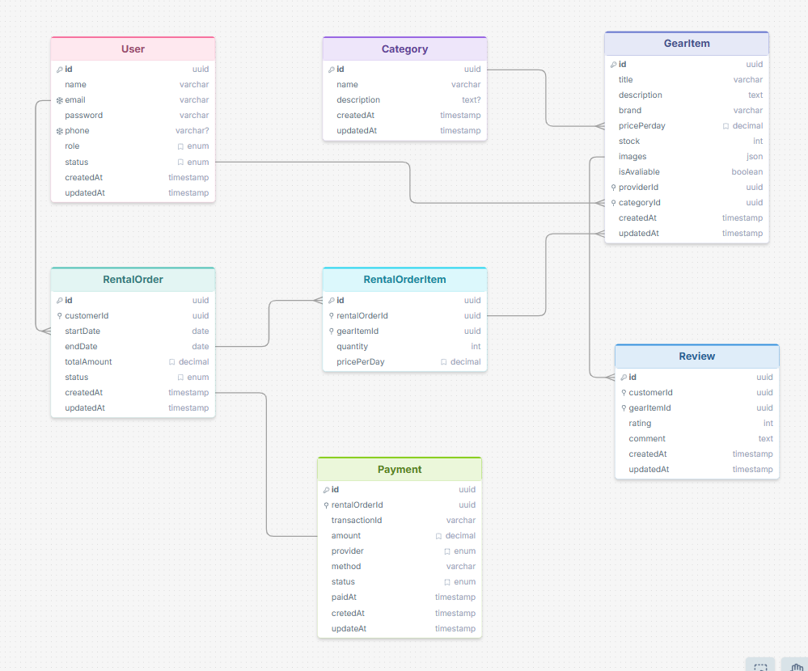

# 🚴 GearUp Backend API

GearUp is a backend API for an outdoor and sports gear rental platform. Customers can browse rental gear, place rental orders, make secure payments using Stripe, and leave reviews after completing rentals. Providers manage their gear inventory and rental orders, while admins oversee users, gear listings, and rental activities.

---


## 📊 ER Diagram



ER Diagram:
https://drawsql.app/teams/shahadat-hossain1/diagrams/gearup-b7a4-erd


## 🚀 Features

- JWT Authentication & Authorization
- Customer, Provider & Admin Roles
- Gear Categories
- Gear CRUD
- Rental Order Management
- Provider Dashboard
- Stripe Payment Integration
- Stripe Webhook
- Review & Rating System
- Admin Dashboard APIs
- Prisma ORM
- PostgreSQL Database
- TypeScript
- Express.js

---

## 🛠️ Tech Stack

- Node.js
- Express.js
- TypeScript
- Prisma ORM
- PostgreSQL
- JWT
- Stripe
- bcrypt
- Cookie Parser
- CORS

---

## 📁 Project Setup

```bash
cd GearUp_Backend
```

### Install Dependencies

```bash
npm install
```

### Setup Environment

Create a `.env` file using `.env.example`.

### Generate Prisma Client

```bash
npx prisma generate
```

### Run Migration

```bash
npx prisma migrate dev
```

### Start Development Server

```bash
npm run dev
```

---

# Environment Variables

```env
PORT=5000

APP_URL=http://localhost:3000

DATABASE_URL=your_database_url

JWT_ACCESS_SECRET=your_access_secret
JWT_ACCESS_EXPIRES_IN=1d

JWT_REFRESH_SECRET=your_refresh_secret
JWT_REFRESH_EXPIRES_IN=7d

BCRYPT_SALT_ROUNDS=10

STRIPE_SECRET_KEY=your_stripe_secret_key
STRIPE_WEBHOOK_SECRET=your_stripe_webhook_secret

STRIPE_SUCCESS_URL=http://localhost:3000/payment/success
STRIPE_CANCEL_URL=http://localhost:3000/payment/cancel
```

---

# API Endpoints

## Authentication

| Method | Endpoint |
|---------|----------|
| POST | /api/auth/register |
| POST | /api/auth/login |
| GET | /api/auth/me |

---

## Categories

| Method | Endpoint |
|---------|----------|
| POST | /api/categories |
| GET | /api/categories |
| PATCH | /api/categories/:id |
| DELETE | /api/categories/:id |

---

## Gear

| Method | Endpoint |
|---------|----------|
| POST | /api/gear |
| GET | /api/gear |
| GET | /api/gear/:id |
| PATCH | /api/gear/:id |
| DELETE | /api/gear/:id |

---

## Rentals

| Method | Endpoint |
|---------|----------|
| POST | /api/rentals |
| GET | /api/rentals |
| GET | /api/rentals/:id |
| PATCH | /api/rentals/:id/cancel |

---

## Payments

| Method | Endpoint |
|---------|----------|
| POST | /api/payments/create |
| POST | /api/payments/confirm |
| POST | /api/payments/webhook |
| GET | /api/payments |
| GET | /api/payments/:id |

---

## Provider

| Method | Endpoint |
|---------|----------|
| POST | /api/provider/gear |
| PUT | /api/provider/gear/:id |
| DELETE | /api/provider/gear/:id |
| GET | /api/provider/orders |
| PATCH | /api/provider/orders/:id |

---

## Reviews

| Method | Endpoint |
|---------|----------|
| POST | /api/reviews |

---

## Admin

| Method | Endpoint |
|---------|----------|
| GET | /api/admin/users |
| PATCH | /api/admin/users/:id |
| GET | /api/admin/gear |
| GET | /api/admin/rentals |

---

# Stripe Testing


Use Stripe Test Card

```
Card Number: 4242 4242 4242 4242

```

---

# Admin Credentials

```text
Email:
admin@gmail.com

Password:
12345678
```

---

# Available Scripts

```bash
npm run dev
```

```bash
npm run build
```

```bash
npm start
```

```bash
npm run stripe:webhook
```

---

# Project Structure

```
src
├── app.ts
├── server.ts
├── config
├── middleware
├── modules
│   ├── auth
│   ├── category
│   ├── gear
│   ├── rental
│   ├── payment
│   ├── provider
│   ├── review
│   └── admin
├── lib
├── utilities
```

---

# Author

**SHEAKH REAZ**


